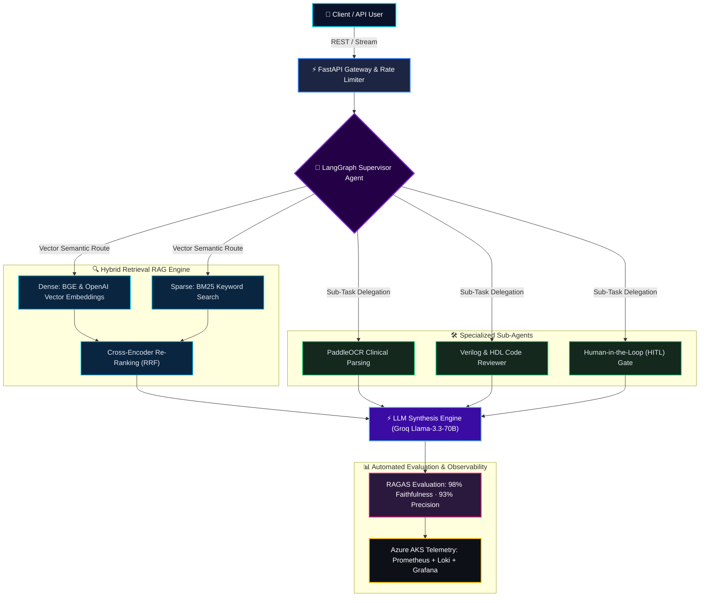

<!-- ═══════════════════════════════════════════════════════════ -->
<!--                    MOHD GOUSH - GITHUB PROFILE              -->
<!-- ═══════════════════════════════════════════════════════════ -->

<!-- Local Ultra-HD Vector Banner (100% Zero-Downtime Guarantee) -->

<!-- Dynamic Animated Typing SVG -->

 

<!-- Profile Badges & Social Links -->

&nbsp;

&nbsp;

&nbsp;

&nbsp;

  

<!-- Quick Jump Anchor Navigation Bar -->
<code><a href="#-quick-highlights-matrix">⚡ Highlights</a></code> •
<code><a href="#-engineering-identity">👨‍💻 About</a></code> •
<code><a href="#%EF%B8%8F-production-agentic-architecture">🏗️ Architecture</a></code> •
<code><a href="#%EF%B8%8F-technical-arsenal">🛠️ Stack</a></code> •
<code><a href="#-featured-engineering-projects">🚀 Projects</a></code> •
<code><a href="#-work-experience">💼 Experience</a></code> •
<code><a href="#-analytics--competitive-programming">📊 Analytics</a></code> •
<code><a href="#-lets-collaborate--connect">🤝 Connect</a></code>

  

<!-- ═══════════════ QUICK HIGHLIGHTS MATRIX ═══════════════ -->

<table>
  <tr>
    <td align="center" width="25%">
      <b>🎓 Academics</b> 
      <b>9.11 / 10 CGPA</b> 
      B.Tech ECE @ IET Lucknow ('27)
    </td>
    <td align="center" width="25%">
      <b>🛡️ Competitive Programming</b> 
      <b>LeetCode Knight (1932)</b> 
      CodeChef 3★ (1648) · 570+ Solved
    </td>
    <td align="center" width="25%">
      <b>🤖 Core Specialization</b> 
      <b>Agentic AI & RAG</b> 
      LangGraph, RAGAS, pgvector
    </td>
    <td align="center" width="25%">
      <b>☁️ Cloud & MLOps</b> 
      <b>Kubernetes & Observability</b> 
      Azure AKS, AWS, Prometheus, Grafana
    </td>
  </tr>
</table>

---

## 👨‍💻 Engineering Identity & Core Principles

<!-- Interactive 3-Card Engineering Principles Matrix -->
<table width="100%">
  <tr>
    <td width="33.3%" valign="top">
      

        <h3>🧠 Deterministic AI</h3>
        Zero-tolerance for hallucinations
      

       
      <ul>
        <li><b>Evaluation-Driven</b>: Automated RAGAS benchmarks for precision &amp; recall.</li>
        <li><b>Hybrid Retrieval</b>: Blending dense semantic embeddings with sparse BM25.</li>
        <li><b>Cross-Encoder</b>: Re-ranking to maximize contextual relevancy.</li>
      </ul>
    </td>
    <td width="33.3%" valign="top">
      

        <h3>⚙️ Cloud &amp; MLOps</h3>
        Scale from local to AKS cluster
      

       
      <ul>
        <li><b>Kubernetes (AKS)</b>: Production containerized orchestration.</li>
        <li><b>Full Observability</b>: Prometheus scrapers &amp; Loki log stream.</li>
        <li><b>Grafana Telemetry</b>: Real-time latency, token usage, and error metrics.</li>
      </ul>
    </td>
    <td width="33.3%" valign="top">
      

        <h3>🥋 Algorithmic Rigor</h3>
        570+ DSA problems solved
      

       
      <ul>
        <li><b>LeetCode Knight</b>: Peak rating <b>1932</b> (Top 3.8% globally).</li>
        <li><b>CodeChef 3★</b>: Peak contest rating <b>1648</b>.</li>
        <li><b>Optimal Complexity</b>: High mathematical rigor applied to compute.</li>
      </ul>
    </td>
  </tr>
</table>

---

## 🏗️ Production Agentic Architecture

---

## 🛠️ Technical Arsenal

### 🤖 AI, LLM & Agentic Frameworks

  
  
  
  
  
  
  
  
  

### ⚙️ Languages, Backend & Databases

  

### ☁️ Cloud, MLOps & Observability

  
  
  
  
  
  

<!-- Interactive Collapsible Knowledge Hub -->

<b>📚 Deep Dive: Core AI & Systems Competencies (Click to expand)</b>

 

| Domain | Key Concepts & Methodologies |
| :--- | :--- |
| **Agentic AI & LLMs** | State Graphs (LangGraph), ReAct Framework, Multi-Agent Supervisors, Human-in-the-Loop, Tool Calling, Structured Outputs |
| **RAG Engineering** | Dense & Sparse Hybrid Retrieval (BM25 + pgvector/ChromaDB), Reciprocal Rank Fusion (RRF), Cross-Encoder Re-Ranking, Chunking Strategies |
| **LLM Evaluation & Guardrails** | RAGAS Framework (Faithfulness, Context Precision, Context Recall, Answer Relevancy), LangSmith Tracing, Hallucination Auditing |
| **Cloud & MLOps** | Azure Kubernetes Service (AKS), AWS EC2, Containerization (Docker), Prometheus Scrapers, Promtail DaemonSet, Grafana Dashboards |

---

## 🚀 Featured Engineering Projects

<table>
<tr>
<td width="50%" valign="top">

### 🛒 [E-Commerce AI Operations Platform](https://github.com/mohdgoush/ecommerce-ai-agent)
> **Autonomous Multi-Agent System with Human-in-the-Loop Orchestration**

- 🤖 **4 Collaborative Agents**: Orchestrated with **LangGraph** & Groq (`llama-3.3-70b-versatile`) generating **100+ daily actions**.
- 🛡️ **Human-in-the-Loop**: Integrated approval gate achieving a **90%+ execution accuracy**.
- ⚡ **High-Performance RAG**: ChromaDB vector index with 1,536-D embeddings delivering **sub-100ms** retrieval latency.
- 📉 **Cost & Latency Optimized**: **30% token reduction** via structured prompt engineering & context pruning.
- 📊 **Automated Evaluation**: Continuous RAGAS metric monitoring scheduled daily.

  
  
  
  

</td>
<td width="50%" valign="top">

### 🏥 [MedRAG AI v2 — Clinical RAG Engine](https://github.com/mohdgoush/medrag-ai-v2)
> **Enterprise Clinical Question-Answering & Report Parsing System**

- 📄 **Multimodal OCR**: **PaddleOCR** ingestion pipeline for raw scanned clinical reports with structured metadata extraction.
- 🧬 **Hybrid Retrieval Pipeline**: Combined **BGE Embeddings + BM25** with cross-encoder re-ranking for ultra-precise medical context.
- 📈 **Benchmark Results**:
  - Context Precision: **52% ➜ 93%**
  - Context Recall: **54% ➜ 96%**
  - Faithfulness: **78% ➜ 98%** (Zero Hallucination Tolerance)
- 🌐 **Fallback Resilience**: Dynamic Tavily Search for real-time validation of out-of-corpus queries.

  
  
  
  

</td>
</tr>
<tr>
<td width="50%" valign="top">

### 🔍 [LLM Product Search & Recommendation](https://github.com/mohdgoush/llm-product-search)
> **Semantic Search Engine with Reciprocal Rank Fusion (RRF)**

- 🧠 **Vector Indexing**: Integrated **PostgreSQL (pgvector)** for high-dimensional cosine similarity indexing.
- 🔄 **Hybrid Fusion**: Blended keyword frequency with dense semantic vectors via **Reciprocal Rank Fusion (RRF)**.
- 🔗 **Deep Traceability**: Full pipeline orchestration via **LangGraph** and monitored through **LangSmith** traces.

  
  
  

</td>
<td width="50%" valign="top">

### ⚡ [ElectroAssist-AI](https://github.com/mohdgoush/ElectroAssist-AI)
> **Specialized Multi-Agent Copilot for Hardware & Electronics Engineers**

- 🔌 **Domain RAG**: Circuit analysis, datasheet parsing, PDF chat, and automated **Verilog/VHDL code review**.
- 👥 **Isolated Knowledge Bases**: Tenant-isolated vector namespaces with **FastAPI** backend and **Streamlit** UI.
- ⚡ **Real-Time Stream**: Low-latency token streaming with tool-use validation for hardware calculations.

  
  
  

</td>
</tr>
</table>

---

## 💼 Work Experience

| Organization | Role | Timeline | Core Impact & Tech Stack |
| :--- | :--- | :--- | :--- |
| **PanScience Innovations** | **AI & Agentic Automation Intern** | *Jul 2026 – Present* | • Architected end-to-end telemetry stack (**Prometheus, Loki, Promtail, Grafana**) on AWS EC2. • Containerized microservices with **Docker** & orchestrating migration to **Azure Kubernetes Service (AKS)**. • Built scalable agentic evaluation pipelines. |
| **IonCure Tech Pvt. Ltd.** | **AI, Data Science & Research Intern** | *Jun 2026 – Jul 2026* | • Engineered multispectral remote-sensing pipelines for mineral exploration. • Benchmarked **Random Forest, XGBoost, and YOLO** with explainable AI (**SHAP** interpretability). |

---

## 📊 Analytics & Competitive Programming

<!-- LeetCode Knight Card & GitHub Stats Side by Side -->
<table>
  <tr>
    <td align="center" width="50%" valign="middle">
      
    </td>
    <td align="center" width="50%" valign="middle">
      
    </td>
  </tr>
  <tr>
    <td align="center" width="50%" valign="middle">
      
    </td>
    <td align="center" width="50%" valign="middle">
      
    </td>
  </tr>
</table>

---

## 🐍 Contribution Activity

Generated dynamically via automated GitHub Actions · Refreshed every 12 hours

---

## 🏆 Honors & Certifications

- 🛡️ **LeetCode Knight** — Peak Contest Rating **1932** (Top ~3.8% globally, 570+ problems solved)
- ⭐ **CodeChef 3-Star** — Peak Contest Rating **1648**
- 📜 **IBM Generative AI Applications Specialization** — Coursera
- 📜 **Microsoft AI & Machine Learning Foundations** — Microsoft
- 📜 **AI for Everyone** — DeepLearning.AI
- 📜 **Data Science & ML Engineering Bootcamp** — Udemy

---

## 🤝 Let's Collaborate & Connect

I am actively open to discussing **Agentic AI systems, Production RAG architectures, MLOps/Kubernetes infrastructure, and Engineering roles**.

 

&nbsp;

&nbsp;

&nbsp;

  

<!-- Local Vector Footer Banner -->

